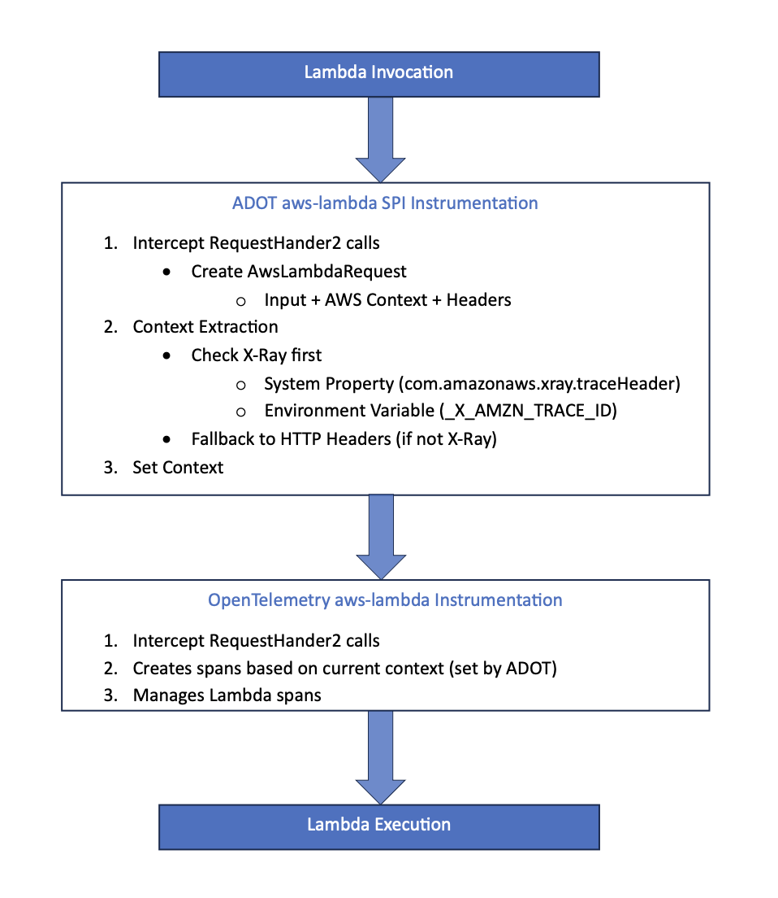

## Exploring Removing Lambda Layer Patches via SPI Integration

### Current Lambda Layer Patches

Why does lambda have separate instrumentation?

1. Event-Driven Architecture:

    * Lambda functions are triggered by various AWS services (API Gateway, SQS, S3, etc.)
    * Each event type has different structures and needs different handling for context propagation

1. Execution Model:

    * Short-lived, stateless functions instead of long-running services
    * Functions experience cold starts and warm starts
    * Context must be propagated through headers/environment
    * Need to handle telemetry flushing before function termination


### ADOT Lambda layer patches currently

1. Prioritize X-Ray context extraction (checking environment variables and system properties first)
2. Optimize API Gateway requests by skipping HTTP header extraction when only X-Ray is being used
3. Add support for RequestStreamHandler alongside RequestHandler

In essence: They make context extraction more efficient by prioritizing X-Ray and avoiding unnecessary header parsing, while also adding stream handler support.


### SPI  Integration Approach

Have our instrumentation run before upstream aws-lambda creates spans. This way, we can conduct context propagation and modify the context to what we want, and hand that over to upstream to make spans based off our context.



### Potential Issues

1. We patch APIGatewayProxyRequest to optimize performance by skipping HTTP header extraction when only X-Ray tracing is being used. This creates two scenarios:
    1. Customers using auto-instrumentation (where we inject our code via ByteBuddy) will get these optimizations through our SPI approach
    2. But customers who manually extend upstream's TracingRequestStreamHandler in their code won't get our optimizations because they're using the unmodified upstream version

The key question is: do our customers actually use upstream's handlers directly in their code, or do they mainly rely on auto-instrumentation? Is APIGatewayProxyRequest used for anything other than by the TracingRequestStreamHandler?

2. In the patch on aws-lamba-events-2.2 patch on AwsLambdaSqsInstrumenterFactory, we remove this line:

````
// Removes span links from upstream's SQS instrumentation
.addSpanLinksExtractor(new SqsMessageSpanLinksExtractor())
````

With an  the SPI, we can’t modify/disable this in upstream. ADOT users would get these span links. Is removing span links important enough to maintain as a patch? Or is it acceptable for users to have these span links when using SPI approach?

3. Possible cold start issues with Lambda (also mentioned by lukesha@)
    1. Adding more instrumentations increases the size of ADOT's JAR file. This larger file size is problematic for Lambda functions because during cold starts, Lambda needs to download and initialize the JAR.
    2. Lambda cold starts are already a performance concern and every millisecond matters. Having a larger JAR due to multiple instrumentations can lead to slower startup times and degraded performance.
4. Ideally, we want to run just before the aws-lambda instrumentation. However, when setting the order() function (in the InstrumentaitonModule):
    1. order = -1 makes our instrumentation run before upstream aws-lamba AND otel api extensions (ex. loads before OpenTelemetry API extensions in upstream
    2. order > 0 makes our instrumentation run after both upstream aws-lamba AND otel api extensions
    3. order = 0 (ie. set to the same number as all upstream InstrumentationModules) results in non-deterministic ordering

Setting order = -1 could be problematic because if our instrumentation calls OpenTelemetry.get() before this API instrumentation runs
1. The call won't be intercepted to return the agent's OpenTelemetry instance 
2. We might get unexpected behavior or miss functionality that the agent provides

However, this API instrumentation module is just handling the redirection of API calls (intercepting OpenTelemetry.get()), not setting up core OpenTelemetry functionality.

### Experimental Implementation for aws-lambda-core-1.0

#### Class Descriptions:

**AdotAwsLambdaInstrumentationModule**

Entry point that tells the agent:

* When to apply our instrumentation: before upstream (set by order function)
* What to instrument: doesn't apply when SQS events are present (handled separately)
* How to instrument: sets up instrumentation for
    * RequestHander
    * RequestStreamHander


**AdotAwsLambdaInstrumentationHelper**

* Central place that creates and manages the instrumenter that all parts of our Lambda instrumentation will use

AdotAwsLambdaRequestHanderInstrumentation
This class finds Lambda handler functions, intercepts them when they run, and sets up the proper context before upstream creates spans

1. Matching:

    * Finds classes that implement RequestHandler interface
    * Excludes AWS internal implementations (api.client and lambdainternal)

2. Transformation:

    * Targets the public handleRequest method
    * Applies our advice to this method

3. The Advice:

    * Intercepts Lambda function invocations
    * Creates a request object
    * Extracts context (prioritizing X-Ray)
    * Makes context current for upstream


**AdotAwsLambdaRequestStreamHanderInstrumentation**
This class is similar to the RequestHandler instrumentation but handles stream-based Lambda functions.

Key Differences from RequestHandler:

* Matches handleRequest method with different arguments (InputStream and position 2 for Context)
* Handles stream-based input instead of object input


**AwsLambdaFunctionInstrumenter**

* Handles deciding if spans should be created
* Extracts context from both request headers and Lambda client context
* Uses OpenTelemetry propagators to extract trace context


**ParentContextExtractor**

* Patch: https://github.com/anahatAWS/aws-otel-java-instrumentation/blob/spi-lambda-layer/lambda-layer/patches/opentelemetry-java-instrumentation.patch#L76
* Responsible for getting trace context from Lambda functions, prioritizing X-Ray headers over HTTP headers, to ensure proper trace continuation

