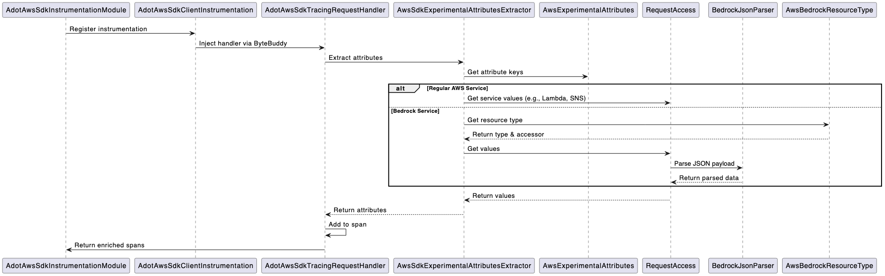
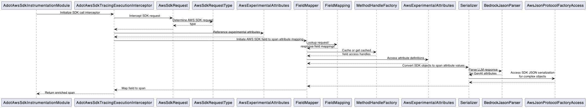

## ADOT AWS SDK Instrumentation

### Overview
The aws-sdk instrumentation is an SPI-based implementation that extends the upstream OpenTelemetry AWS Java SDK instrumentation.

##### _v1.11 Initialization Workflow_
1. OpenTelemetry Agent Starts 
    - Loads default instrumentations 
    - Loads aws-sdk v1.11 instrumentations
    - Injects **TracingRequestHandler** into constructor
2. Scans for other SPI implementations
    - Finds ADOT’s **AdotAwsSdkInstrumentationModule**
    - Injects code that:
      - Checks for TracingRequestHandler
      - If present, adds **AdotAwsSdkTracingRequestHandler**
3. AWS SDK Client Created 
   - Constructor runs with injected code:
      [AWS Handlers] → TracingRequestHandler → AdotAwsSdkTracingRequestHandler

##### _v2.2 Initialization Workflow_

1. OpenTelemetry Agent starts
   - Loads default instrumentations
   - Loads aws-sdk instrumentation from opentelemetry-java-instrumentation
   - Registers **TracingExecutionInterceptor** (order = 0)
2. Scans for other SPI implementations
   - Finds ADOT’s **AdotAwsSdkInstrumentationModule**
   - Registers **AdotAwsSdkTracingExecutionInterceptor** (order > 0)

#### _Note on Attribute Collection:_
AWS SDK v1.11 and v2.2 handle attribute collection differently:

**V1.11:**
- Maintains a separate AttributesBuilder during request/response lifecycle
- Collects ADOT-specific attributes alongside upstream processing without interference
- Injects collected attributes into span at the end of the request and response lifecycle hooks


**V2.2:**
- FieldMapper directly modifies spans during request/response processing
- Attributes are added to spans immediately when discovered
- Direct integration with span lifecycle

This architectural difference exists due to upstream AWS SDK injecting attributes into spans differently for v1.11 and v2.2

### AWS SDK v1 Instrumentation Summary
The AdotAwsSdkInstrumentationModule uses the instrumentation (specified in AdotAwsClientInstrumentation) to register the AdotAwsSdkTracingRequestHandler through `typeInstrumentations`.

Key aspects of handler registration:
- `order` method ensures ADOT instrumentation runs after OpenTelemetry's base instrumentation. It is set to the max integer value, as precaution, in case upstream aws-sdk registers more handlers.
- `AdotAwsSdkClientInstrumentation` class adds ADOT handler to list of request handlers

**AdotAwsSdkClientInstrumentation**

AWS SDK v1.11 instrumentation requires ByteBuddy because, unlike v2.2, it doesn't provide an SPI for adding request handlers. While v2.2 uses the ExecutionInterceptor interface and Java's ServiceLoader mechanism, v1.11 maintains a direct list of handlers that can't be modified through a public API. Therefore, we use ByteBuddy to modify the AWS client constructor and inject our handler directly into the requestHandler2s list.

  - `AdotAwsSdkClientAdvice` registers our handler only if the upstream aws-sdk span is enabled (i.e. it checks if the upstream handler is present when an AWS SDK client is
  initialized).
    - Ensures the OpenTelemetry handler is registered first.

**AdotAwsSdkTracingRequestHandler**

The AdotAwsSdkTracingRequestHandler hooks onto OpenTelemetry's spans during specific phases of the SDK request and response life cycle. These hooks are strategically chosen to ensure proper ordering of attribute injection.

1.  `beforeRequest`: the latest point where the SDK request can be obtained after it is modified by the upstream aws-sdk v1.11 handler
2.  `afterAttempt`: the latest point to access the SDK response before the span closes in the upstream afterResponse/afterError methods
    - _NOTE:_ We use afterAttempt not because it's ideal, but because it our last chance to add attributes, even though this means our logic runs multiple times during retries. 
    - This is a trade-off:
      - We get to add our attributes before span closure 
      - But our code runs redundantly on each retry attempt 
      - We're constrained by when upstream closes the span

All the span lifecycle hooks provided by AWS SDK RequestHandler2 can be found [here.](https://docs.aws.amazon.com/AWSJavaSDK/latest/javadoc/com/amazonaws/handlers/RequestHandler2.html#beforeMarshalling-com.amazonaws.AmazonWebServiceRequest)

_**Important Notes:**_
- The upstream interceptor's last point of request modification occurs in [beforeRequest](https://github.com/open-telemetry/opentelemetry-java-instrumentation/blob/main/instrumentation/aws-sdk/aws-sdk-1.11/library/src/main/java/io/opentelemetry/instrumentation/awssdk/v1_11/TracingRequestHandler.java#L58).
- The upstream interceptor closes the span in [afterResponse](https://github.com/open-telemetry/opentelemetry-java-instrumentation/blob/main/instrumentation/aws-sdk/aws-sdk-1.11/library/src/main/java/io/opentelemetry/instrumentation/awssdk/v1_11/TracingRequestHandler.java#L116) and/or [afterError](https://github.com/open-telemetry/opentelemetry-java-instrumentation/blob/main/instrumentation/aws-sdk/aws-sdk-1.11/library/src/main/java/io/opentelemetry/instrumentation/awssdk/v1_11/TracingRequestHandler.java#L131). These hooks are inaccessible for span modification.
  `afterAttempt` is our final hook point, giving us access to both the fully processed response and active span.

**High-Level Sequence Diagram:**


_Class Functionalities:_
- `AdotAwsSdkTracingRequestHandler`
  - Hooks into AWS SDK request/response lifecycle 
  - Adds ADOT-specific attributes to spans extracted by AwsSdkExperimentalAttributesExtractor
- `AwsSdkExperimentalAttributesExtractor`
  - Extracts attributes from AWS requests/responses and enriches spans
  - Uses RequestAccess to get field values
  - Special handling for Bedrock services
- `RequestAccess`
  - Provides access to AWS SDK object fields 
  - Caches method handles for performance 
  - Uses BedrockJsonParser for parsing LLM payloads
- `BedrockJsonParser`
  - Custom JSON parser for Bedrock payloads
  - Handles different LLM model formats
- `AwsBedrockResourceType`
  - Maps Bedrock class names to resource types
  - Provides attribute keys and accessors for each type

### AWS SDK v2 Instrumentation Summary

**AdotAwsSdkInstrumentationModule**

The AdotAwsSdkInstrumentationModule registers the AdotAwsSdkTracingExecutionInterceptor in `registerHelperResources`.

Key aspects of interceptor registration:
- AWS SDK's ExecutionInterceptor loads global interceptors from files named '/software/amazon/awssdk/global/handlers/execution.interceptors' in the classpath
- Interceptors are executed in the order they appear in the classpath - earlier entries run first
- `order` method ensures ADOT instrumentation runs after OpenTelemetry's base instrumentation, maintaining proper sequence of interceptor registration in AWS SDK classpath

**AdotAwsSdkTracingExecutionInterceptor**

The AdotAwsSdkTracingExecutionInterceptor hooks onto OpenTelemetry's spans during specific phases of the SDK request and response life cycle. These hooks are strategically chosen to ensure proper ordering of attribute injection.

1. `beforeTransmission`: the latest point where the SDK request can be obtained after it is modified by the upstream's interceptor
2. `modifyResponse`: the latest point to access the SDK response before the span closes in the upstream afterExecution method

All the span lifecycle hooks provided by AWS SDK ExecutionInterceptor can be found [here.](https://sdk.amazonaws.com/java/api/latest/software/amazon/awssdk/core/interceptor/ExecutionInterceptor.html)

_**Important Notes:**_
- The upstream interceptor's last point of request modification occurs in [beforeTransmission](https://github.com/open-telemetry/opentelemetry-java-instrumentation/blob/release/v2.11.x/instrumentation/aws-sdk/aws-sdk-2.2/library/src/main/java/io/opentelemetry/instrumentation/awssdk/v2_2/internal/TracingExecutionInterceptor.java#L237).
- The upstream interceptor closes the span in [afterExecution](https://github.com/open-telemetry/opentelemetry-java-instrumentation/blob/release/v2.11.x/instrumentation/aws-sdk/aws-sdk-2.2/library/src/main/java/io/opentelemetry/instrumentation/awssdk/v2_2/internal/TracingExecutionInterceptor.java#L348). That hook is inaccessible for span modification.
`modifyResponse` is our final hook point, giving us access to both the fully processed response and active span.

**High-Level Sequence Diagram:**


_Class Functionalities:_
- `AdotAwsSdkTracingExecutionInterceptor`
  - Intercepts AWS SDK calls to create and enrich OpenTelemetry spans with AWS attributes
  - Coordinates the attribute mapping process
- `FieldMapper`
  - Maps the AWS SDK fields to span attributes
  - Coordinates with Serializer for value conversion
- `FieldMapping`
  - Defines what fields to map from SDK to spans
  - Groups mappings by type (REQUEST/RESPONSE)
- `MethodHandleFacotry`
  - Provides fast, cached access to AWS SDK object fields for better performance
  - Used by FieldMapper for efficient field value extraction
- `Serializer`
  - Converts AWS SDK objects and Bedrock objects into string values that can be used as span attributes
  - Works with BedrockJsonParser for LLM responses
- `AwsJsonProtocolFactoryAccess`
  - Enables access to AWS SDK's internal JSON serialization capabilities for complex SDK objects
  - Uses reflection to access internal SDK classes
  - Caches method handles for performance
- `BedrockJasonParser`
  - Parses and extracts specific attributes from Bedrock LLM responses for GenAI telemetry

### Commands for Running Groovy Tests

#### aws-sdk v1.11
To run the `BedrockJsonParserTest`:
````
./gradlew :instrumentation:aws-sdk:test --tests "software.amazon.opentelemetry.javaagent.instrumentation.awssdk_v1_11.BedrockJsonParserTest"
````

#### aws-sdk v2.2
To run the `BedrockJsonParserTest`:
````
./gradlew :instrumentation:aws-sdk:test --tests "software.amazon.opentelemetry.javaagent.instrumentation.awssdk_v2_2.BedrockJsonParserTest"
````

### Commands for Running Java Tests

#### aws-sdk v1.11
To run the `AwsSdkExperimentalAttributesInjectionTest`:
````
./gradlew :instrumentation:aws-sdk:test --tests "software.amazon.opentelemetry.javaagent.instrumentation.awssdk_v1_11.AwsSdkExperimentalAttributesInjectionTest"
````

To run the `AdotAwsSdkClientAdviceTest`:
````
./gradlew :instrumentation:aws-sdk:test --tests "software.amazon.opentelemetry.javaagent.instrumentation.awssdk_v1_11.AdotAwsSdkClientAdviceTest"
````

#### aws-sdk v2.2
To run the `AwsSdkExperimentalAttributesInjectionTest`:
````
./gradlew :instrumentation:aws-sdk:test --tests "software.amazon.opentelemetry.javaagent.instrumentation.awssdk_v2_2.AwsSdkExperimentalAttributesInjectionTest"